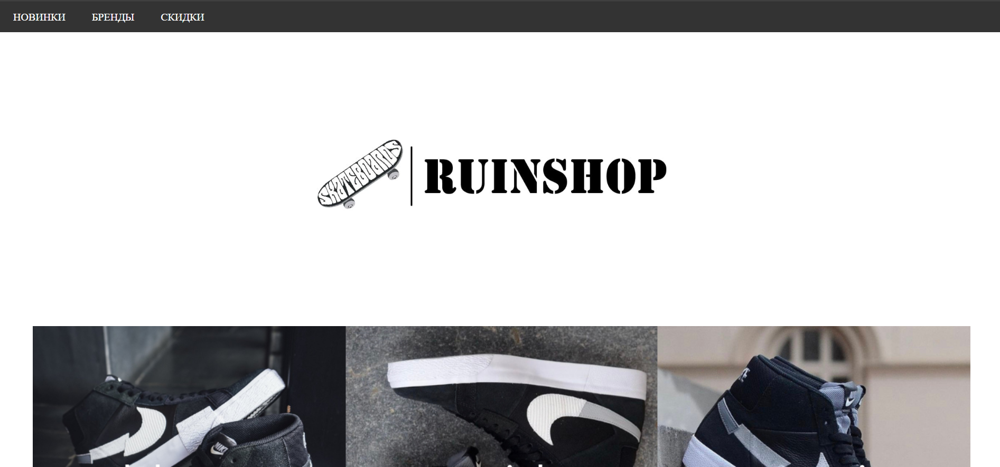
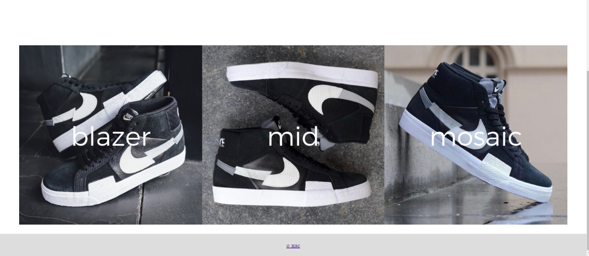
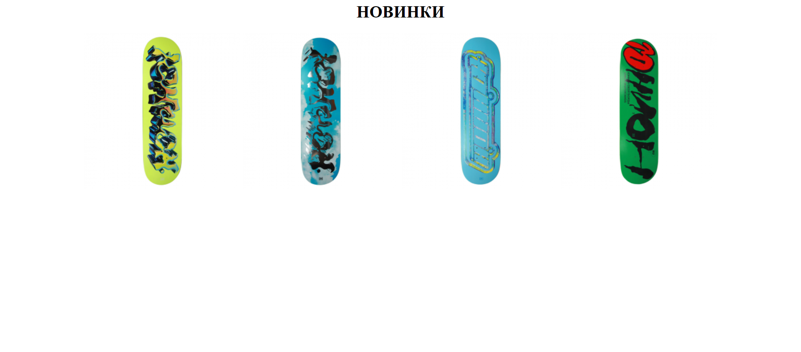
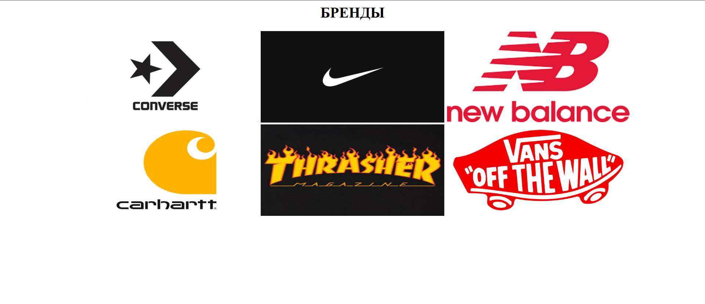
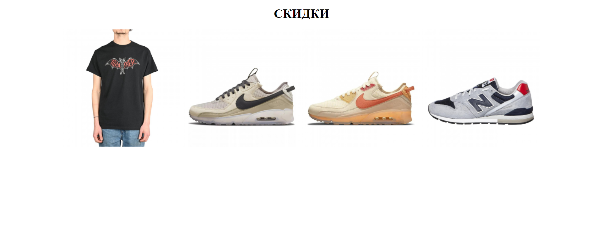

# задание 1
<h1 align = "center">NIKE</h1>

<h2 align = "center">Создатели бренда</h2>
Создатели бренда Nike познакомились в 1957 году в Университете штата Орегон. Билл Бауэрман — тренер по легкой атлетике, и первокурсник Фил Найт — бегун на среднюю дистанцию. Двое мужчин, страстно любящих спорт, сразу же нашли общий язык. Билл Бауэрман воспитал множество олимпийских чемпионов из числа студентов университета, уделяя большое внимание их всестороннему развитию, а не только физическим тренировкам. В 1972 году его пригласили занять пост тренера олимпийской команды США по легкой атлетике. После смерти великого коуча удостоили собственным бюстом в Национальном зале славы.

# задание 2

# задание 3 

# задание 3_1

# задание 4

<h4 align = "center">главная страница сайта</h4>

<h4 align = "center">новинки</h4>

<h4 align = "center">бренды</h4>

<h4 align = "center">скидки</h4>

# задание 5

# задание 6
